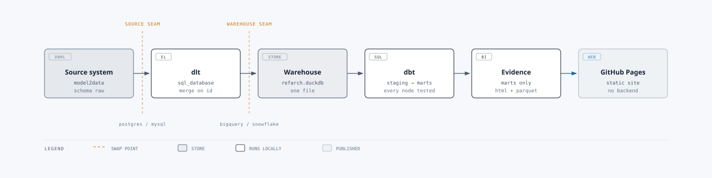

# Reference architecture

A complete, running analytics stack — from a data model to a dashboard — that stands up on a
laptop with no database access, and then points at a real database by changing one connection
string.



`model2data` → `dlt` → BigQuery → `dbt` → Lightdash. Every layer is real and every layer runs;
nothing here is a sketch of how it would work.

It is published as something to read and take apart. Clone it, run it, disagree with the layering,
copy the bits that are useful. It is a worked example rather than a library, so there is no package
to install and no API to keep stable.

## Why it is built this way

**The source system is synthetic, and that is the point.** Most reference architectures either
ship a static CSV, which teaches you nothing about incremental loading, or need access to a
production database, which you usually do not have when you start. Here,
[model2data](https://github.com/JB-Analytica/model2data) turns `source_system/webshop.dbml` into a
real, relationship-preserving database with a Q4 peak, a realistic cancellation rate and a
long-tailed order distribution. The pipeline that reads it is `dlt`'s generic `sql_database`
source — the same one you would point at Postgres.

**Metrics live in dbt, not in the BI tool.** Lightdash reads the dbt YAML as its semantic layer,
so `net_revenue_eur` is defined once, reviewed in a pull request, and cannot drift between
dashboards.

**Only the marts are visible.** Every mart is tagged `lightdash` and the project's table selection
is restricted to that tag, so staging and intermediate models stay available for lineage and
debugging but never reach someone building a chart.

**Data that behaves like a business.** Uniformly random test data hides the bugs that matter: it
will never show you a dashboard that breaks in December, or the query that falls over on your
largest account. The generated orders grow across the window, peak in Q4, cancel about 5% of the
time, and concentrate on a minority of customers. All of it is deterministic, so the same schema
and seed always produce the same rows.

## What you need first

| Requirement | Why | Notes |
|---|---|---|
| [uv](https://docs.astral.sh/uv/) | runs everything Python | `brew install uv`, or the official installer |
| A Google Cloud project with BigQuery enabled | the warehouse | **this costs money** — see [Cost](#cost) |
| A service-account JSON key | how dbt and dlt authenticate | needs **BigQuery Job User** + **BigQuery Data Editor** |
| Node.js **24 or newer** | the Lightdash CLI requires it | stage 4 only |
| A [Lightdash](https://www.lightdash.com/) account | the BI layer | Cloud or self-hosted |

Only stage 4 needs Node and Lightdash. Stages 1–3 run without either, and the test suite needs
neither, nor any warehouse.

## Quick start

```bash
uv sync --extra dev
```

Copy the environment template and fill it in. `GCP_PROJECT` and `GOOGLE_APPLICATION_CREDENTIALS`
are required and have no defaults, so a fresh clone cannot quietly write to somebody else's
warehouse:

```bash
cp .env.example .env
```

Install the Lightdash CLI on Node 24 or newer, and log in:

```bash
npm install -g @lightdash/cli@2.177.0 && lightdash login https://app.lightdash.cloud
```

Run the first three stages, which need nothing from Lightdash:

```bash
uv run refarch generate && uv run refarch load && uv run refarch transform
```

Then create the Lightdash project. **Use `--create` on the first run** — without it the deploy
looks for a project that does not exist yet:

```bash
uv run refarch deploy --create "Reference Architecture" --target prod
```

After that, the whole thing is one command:

```bash
uv run refarch run --target prod
```

### The four stages

| Stage | Command | What happens |
|---|---|---|
| 1 | `refarch generate` | model2data builds the synthetic source system as a DuckDB file |
| 2 | `refarch load` | dlt loads it into BigQuery, incrementally, merging on the primary key |
| 3 | `refarch transform` | dbt builds and tests staging → intermediate → marts |
| 4 | `refarch deploy` | Lightdash gets the semantic layer, the charts and the dashboard |

`refarch transform` passes extra arguments straight through to dbt, so
`refarch transform build -s +fct_orders` and `refarch transform source freshness` both work.

### What success looks like

A finished run gives you roughly 13,600 rows across four source tables, 64 passing dbt tests
including one unit test, nine Lightdash explores, nine charts and one dashboard. Re-running the
load adds no duplicate rows, because every table merges on its primary key.

## Working on it

```bash
uv run poe check     # ruff, ty and pytest
uv run pytest        # tests alone — no warehouse and no credentials needed
```

The pipeline tests run dlt for real against a temporary DuckDB file, so the extraction logic
including incremental merge is covered without touching BigQuery.

## Layout

- `source_system/` — the DBML data model. The only description of the source system.
- `refarch/` — the Python package: config, the model2data wrapper, the dlt pipeline, the CLI.
- `dbt/` — the dbt project. `models/marts/_marts__models.yml` carries the semantic layer.
- `lightdash/` — charts and dashboards as code, uploaded by `refarch deploy`.
- `tests/` — pytest, mirroring the package.
- `docs/` — [architecture](docs/architecture/README.md), [runbook](docs/runbook.md),
  [versions](docs/versions.md).

`source_system/generated/`, `.env` and `dbt/target/` are git-ignored. The generated data is
deterministic, so it is rebuilt rather than committed.

## Pointing it at a real database

The synthetic source exists so the stack can run before you have access to anything. Replacing it
is the whole design:

1. Point `webshop_source()` in [refarch/pipelines/webshop.py](refarch/pipelines/webshop.py) at your
   own database — it takes a SQLAlchemy URL and a list of tables.
2. Update `TABLES` with each table's cursor column, which is what makes the load incremental.
3. Delete `source_system/`, `refarch/generate.py` and the `generate` command.

Everything from staging upward is unchanged. That property is the reason the repo is shaped this
way, and the diagram above is mostly about that one seam.

## Automation

Two GitHub Actions workflows. `ci.yml` runs lint, types and tests on every push and pull request,
and additionally runs `dbt build` when a `GCP_SA_KEY` secret is present. `pipeline.yml` runs the
full four-stage pipeline and is **manual only** — there is no schedule, so it never spends money on
its own. Trigger it from the Actions tab or with `gh workflow run pipeline.yml`.

Running `pipeline.yml` needs three repository secrets: `GCP_SA_KEY`, `LIGHTDASH_API_KEY` and
`LIGHTDASH_PROJECT_UUID`.

## Cost

This writes real data to BigQuery. The generated dataset is small, on the order of 13,600 rows, so
storage and query costs are negligible — but they are not zero, and they are yours. Nothing runs on
a schedule; every run is one you asked for.

## Versions

Every library is at its latest stable release, with `uv.lock` committed. dbt-core 2.0 is
deliberately *not* used: it is still a release candidate, and the only adapter that accepts it is a
beta. See [docs/versions.md](docs/versions.md) for the reasoning and the one-line command to trial
it anyway.

## Licence

[MIT](LICENSE) — use it, change it, ship it.

## Credits

Built and maintained by [JB Analytica](https://www.jbanalytica.com/), on top of
[model2data](https://github.com/JB-Analytica/model2data), [dlt](https://dlthub.com/),
[dbt](https://www.getdbt.com/) and [Lightdash](https://www.lightdash.com/).
